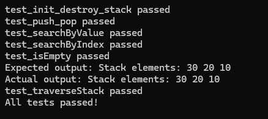
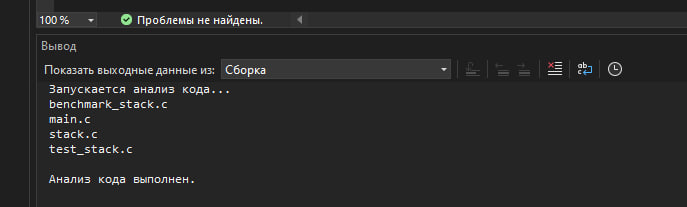
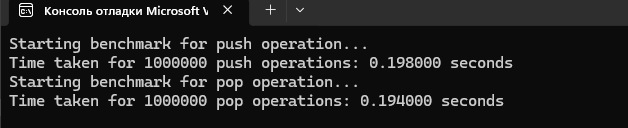
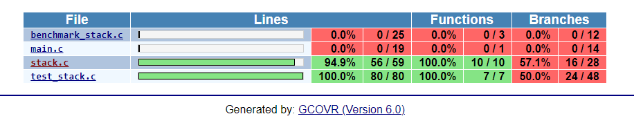
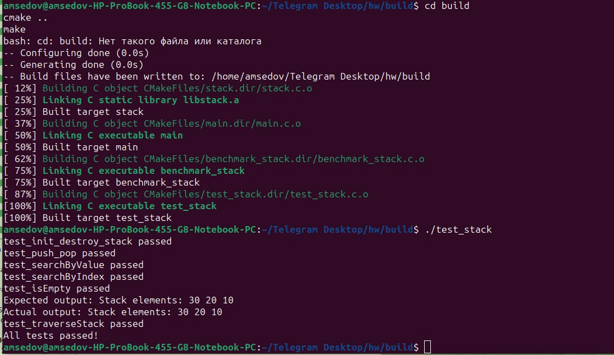

# Домашнее задание

Файлы stack.c и stack.h являются простой реализацией стека, хранящего целые числа.
В коде есть баги и ошибки.

Необходимо привести код в порядок.

  * Исправить ошибки;
  * Покрыть код тестами;
  * Проверить покрытие кода тестами (убедиться, что все функции и условия протестированы);
  * Выбрать статический анализатор и запустить его (исправить ошибки, если будут);
  * Запустить тесты с санитайзерами (исправить ошибки, если будут);
  * Для базовых функций (push / pop) написать бенчмарки;
  * Изучить возможности Github Actions и настроить CI для тестирования (*).

Во время рефакторинга разрешается изменять не только код функций, но и их c сигнатуры,
если это будет оправдано с точки зрения использования/тестирования этих функций.

Решение - Pull Request с исправлением. Желательно разбивать изменения на атомарные коммиты
с целью повышения качества ревью и ускорения получения фидбека.

(*) - необязательное задание.

## Выполнил: Седов Артём, М24-ИВТ4

### Описание выполненной работы

1. **Исправление ошибок**:
   - Исправление ошибок в файлах `stack.c` и `stack.h` (управление памятью)

2. **Покрытие кода тестами**:
   - Юнит-тесты в файле `test_stack.c`, охватывающие основные функции 
   

3. **Выбор и запуск статического анализатора**:
   - Все найденные предупреждения устранены.
    

4. **Создание бенчмарков для функций `push` и `pop`**:
   - Написан файл `benchmark_stack.c`, выполняющий многократные операции `push` и `pop` для измерения их производительности.

5. **Проверка покрытия кода тестами** (Пришлось перейти на Linux):
   
   Более подробно см. 05_hw\coverage.html

6. **Запуск тестов с санитайзерами**:
   - Запущены тесты с AddressSanitizer, Undefined Behavior Sanitizer и LeakSanitizer для выявления проблем с памятью и неопределённым поведением. Все обнаруженные проблемы устранены.
    

7. **Настройка CI с GitHub Actions**:
   - Файл конфигурации `.github/workflows/ci.yml` для автоматического запуска тестов при каждом коммите и pull request.
   - Включены: сборка, запуск тестов и проверка с санитайзерами для повышения стабильности кода.

